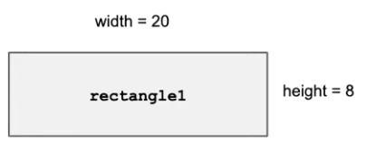
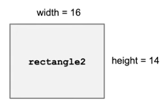
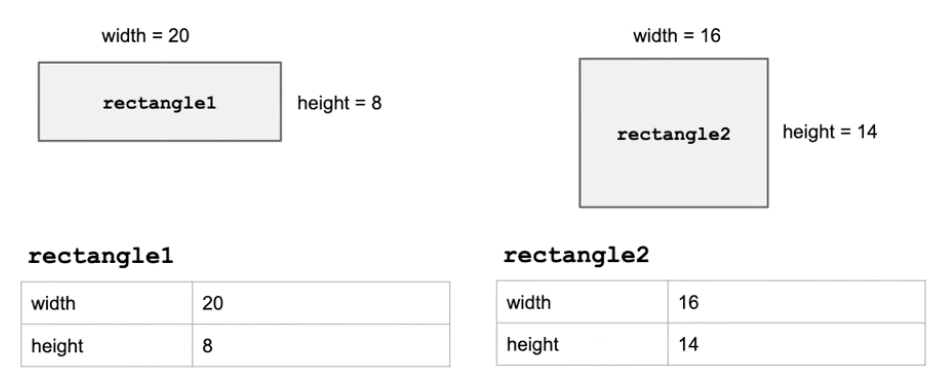

# Objects: Instances of Classes

## Introduction to Objects: 

> An *`object`* is a variable of a data type that is user defined.
* An object has both *`state`* and *`behavior`*.
### Example 1: 
#### This rectangle certain attributes such as height and width


> The *`state`* is data about an object, therefore the state of this rectangle is its width of 20 and height of 8

> The *`behabior`* of and object is teh actions that can be performed on the object, so one behavior of this rectancle can be calculate its area - `which is 160`.

------------------
### Objects are created from *`classes`*
#### A *`class`* is a template fro creating an object.

### *The pseudocode of a rectangle class*

``` 
The Rectangle class:
{
    Every rectangle must have a width and height.

    The area and perimeter of every rectangel can be computed using the values of width and height.
}
```
------------------

> The *`class`* is the template or skeleton used to create an *`object`*. When filled out correctly, the result is an *`object`* itself.

### *Rectangle Object*
### *Template* (Class)

##### **objectName**
|    width    |             |
| ----------- | ----------- |
|    height   |             |

### *Rectangle Object*

##### **rectangle 2**
|    width    |      16     |
| ----------- | ----------- |
|    height   |      14     |



------------------

> When an object is created, it is referred to as an *`instance`* of the *`class`* that it belongs to.



------------------

> ## Using object type variables in programming is often referred to as object oriented programming!