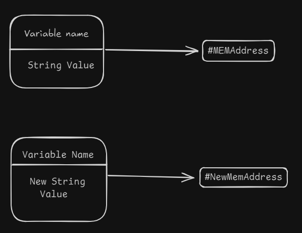

# Strings

## Definition of Strings:
> String are objects of the *`String`* class that hold sequences of characters (a,b, c, $, etc).

## Characteristics of Strings

* Strings are a Class Data Type, instead of ints, floats, etc that are Primitive Data Types

* Strings are immutable, so you cannot change the actual value, but just change the memory address.


## General Sintax of String class

#### Using String Literal
```
String variableName = "[String Literal]";
```

#### Using String Class

```
String varName = new String("[String value]");
```

## String Concatenation
> String Concatenation is just sum up a series of strings literals to make another string literal

### General Sintax

```
String stringContat = string1 + string2 + ... + stringN;
```

> If you want to sum up two ints in a String concatenation, you should put them in parenthesis ()

## Escape Sequences

> Escape Sequences allow us to insert expecial symbols in a String literal

### Examples
* Quote: `\"`
* New Line: `\n`
* Tab: `\t`
* Single Quote: `\'`
* Backslash: `\\`